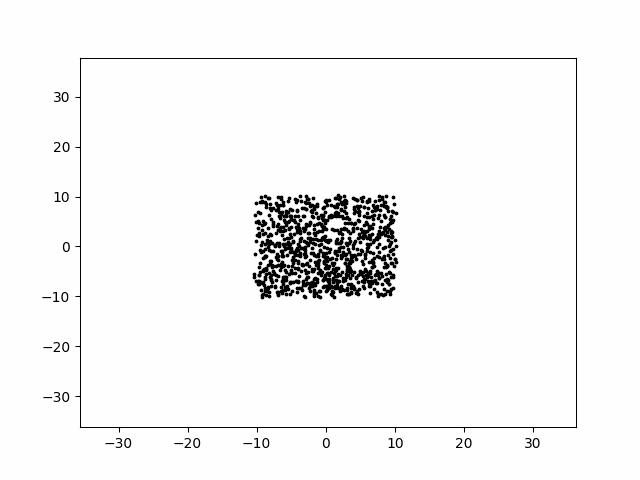

# lab1_n_body_parralel

### Comparison table
t = Threads
b = amount of bodies

 t\b |      100 |      500 |     1000 |    2000 |
|---:|---------:|---------:|---------:|--------:|
|  1 | 0.044014 | 2.15669  | 10.1971  | 41.8452 |
|  2 | 0.052292 | 1.63391  |  9.12408 | 38.3725 |
|  4 | 0.066577 | 0.904991 |  6.74191 | 36.3271 |
|  6 | 0.078514 | 0.973992 |  4.32008 | 35.2831 |

